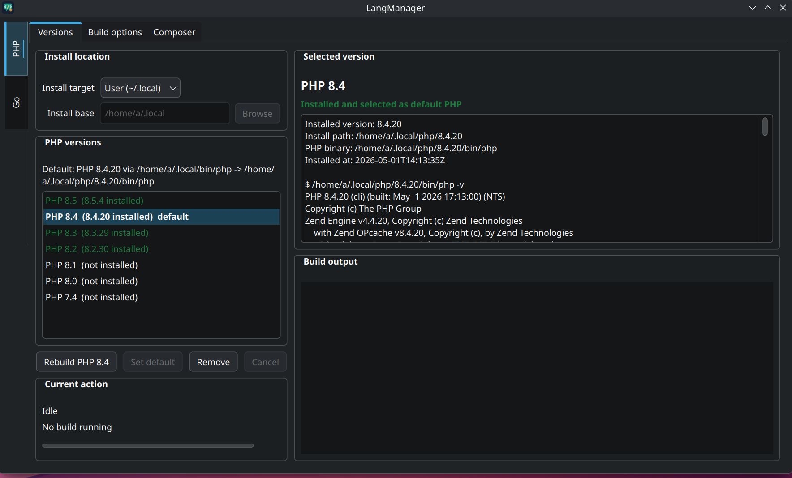
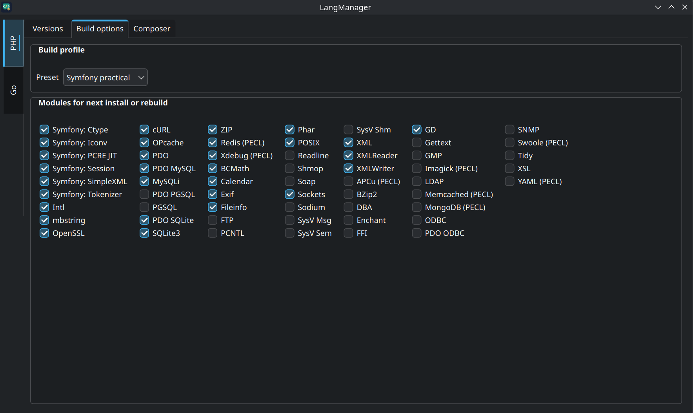
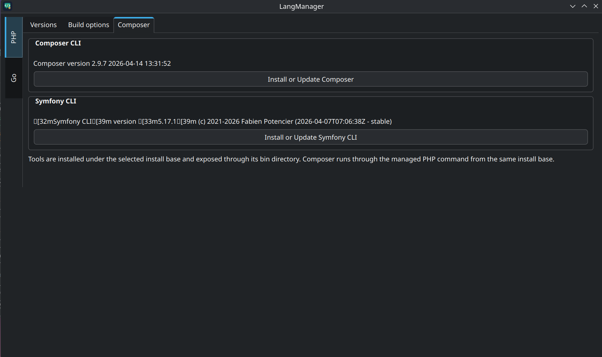
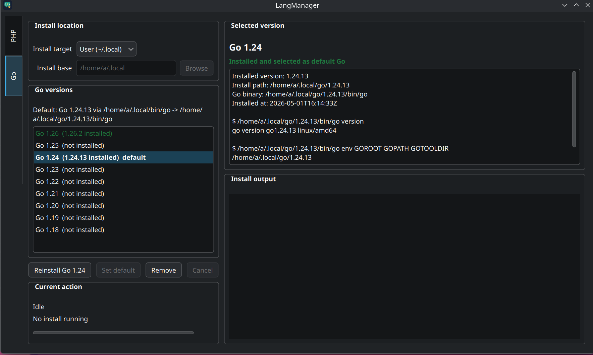

# LangManager

LangManager is a Qt Widgets application for Linux that manages local PHP and Go runtimes. It lets you choose a PHP branch, select modules, build PHP from source into a user-controlled install base, make that PHP version the default through managed symlinks, and install Composer, Symfony CLI, or Go toolchains next to it.

The main design goal is to keep the operating system clean. LangManager tries to build PHP and the native libraries required by selected PHP modules inside the chosen install base, such as `~/.local`, instead of asking you to install a long list of global `*-dev` packages. The OS still needs the basic tools required to run the app and compile software: Qt 6, CMake, Ninja, libarchive, a compiler, and `make`.

## Screenshots

### PHP Versions



The main PHP screen shows the install base, available PHP branches, installed patch versions, the current default PHP, and diagnostic output for the selected version. This is where you install, rebuild, remove, or mark a PHP version as default.

### PHP Build Options



The Build options tab controls the next PHP install or rebuild. You choose a build profile and the exact PHP modules to compile. Symfony-related modules are placed first, while heavier or less common modules stay disabled until you explicitly select them.

### Composer And Symfony CLI



The Composer tab installs or updates Composer and Symfony CLI inside the selected install base. Composer runs through the managed PHP command from the same base, so it does not depend on the system `/usr/bin/php`.

### Go Versions



The Go section uses the same install-base and default-symlink model. The selected Go version is downloaded as an official Linux archive, extracted locally, and exposed through managed links in `~/.local/bin`.

## What The Project Does

LangManager handles several related developer-environment tasks:

- downloads PHP source archives for selected versions;
- extracts archives with `libarchive`, without shelling out to `tar`;
- builds selected native dependencies locally under the target PHP prefix;
- runs the real PHP build pipeline: `configure`, `make`, and `make install`;
- writes `php.ini` so CLI PHP loads OPcache, Xdebug, and other selected extensions immediately;
- installs PECL extensions after PHP itself is installed;
- keeps a JSON registry of installed PHP versions;
- switches the default PHP through managed symlinks in the install base `bin` directory;
- installs Composer and Symfony CLI locally;
- downloads and installs official Go toolchain archives;
- switches the default Go through managed `go` and `gofmt` symlinks;
- provides a small `langmanager` CLI companion script for terminal workflows.

LangManager is not a wrapper around a distribution package manager. It does not call `pacman`, `apt`, `dnf`, or similar tools to install PHP modules. Its purpose is to build and keep runtimes next to the user, isolated from system PHP and system Go.

## Core Idea: PHP Without Extra System Dependencies

A broad PHP build often turns into installing many operating-system development packages, for example `libxml2-dev`, `openssl-dev`, `curl-dev`, `icu-dev`, `sqlite-dev`, `libzip-dev`, `oniguruma-dev`, `postgresql-dev`, `unixodbc-dev`, and more. LangManager takes a different approach.

When a module needs an external native library, the app tries to download that library's source code, build it locally, and install it under the specific PHP version:

```text
~/.local/php/8.4.20/deps/<package>/
```

PHP configure then sees those local dependencies through:

```text
PKG_CONFIG_PATH
CPPFLAGS
LDFLAGS
LD_LIBRARY_PATH
CMAKE_PREFIX_PATH
PATH
```

For example, if `ODBC` or `PDO ODBC` is selected, LangManager builds `unixODBC` locally and passes PHP flags like:

```text
--with-unixODBC=${unixODBC}
--with-pdo-odbc=unixODBC,${unixODBC}
```

The `${unixODBC}` placeholder is resolved to the real local prefix:

```text
~/.local/php/8.4.20/deps/unixODBC
```

The same model is used for many common dependencies:

- `OpenSSL` uses a local OpenSSL build;
- `cURL` uses a local curl build;
- `XML`, `XMLReader`, `XMLWriter`, and `SimpleXML` use a local libxml2 build;
- `Intl` uses a local ICU build;
- `mbstring` uses a local oniguruma build;
- `GMP` uses a local GMP build;
- `Sodium` uses a local libsodium build;
- `AMQP` uses a local rabbitmq-c build;
- `Imagick` uses a local ImageMagick build;
- `ZIP` uses a local libzip build;
- `SQLite3` and `PDO SQLite` use a local SQLite build;
- `GD` uses local zlib, jpeg, and libpng builds;
- `PDO PGSQL` and `PGSQL` use a local PostgreSQL/libpq build;
- `ODBC` and `PDO ODBC` use a local unixODBC build.

This does not mean the operating system is irrelevant. A compiler, `make`, basic build tools, and the GUI application's own dependencies are still required. The important point is that LangManager tries not to turn PHP module installation into a system-wide installation of dozens of extra development packages.

## Architecture

The project is written in C++17 and Qt 6. The build is defined in `CMakeLists.txt`.

Main components:

- `MainWindow` builds the Qt interface, manages PHP and Go tabs, version lists, install buttons, status text, logs, and build profiles.
- `PhpVersionCatalog` defines available PHP channels and patch versions.
- `GoVersionCatalog` defines available Go channels, computes official archive names, and maps Linux CPU architectures.
- `BuildCatalog` defines PHP modules, build profiles, PECL packages, and local source dependencies.
- `PhpBuildController` runs the PHP build state machine.
- `GoInstallController` downloads and installs Go toolchains.
- `ArchiveExtractor` extracts archives through `libarchive`.
- `FileDownloader` downloads standalone tools such as Composer and Symfony CLI.
- `PhpDefaultSwitcher` creates default symlinks for PHP tools.
- `GoDefaultSwitcher` creates default symlinks for Go tools.
- `PhpToolInstaller` installs Composer and Symfony CLI into the selected install base.
- `ShellPathHelper` checks `PATH` and can add the install base `bin` directory to the user's shell config.
- `BuildArtifactCleaner` removes temporary build workspaces and unnecessary runtime artifacts after a successful build.

## Install Base Model

LangManager is centered around a selected install base. The default is:

```text
~/.local
```

Inside that base, the app creates separate trees:

```text
~/.local/bin/
~/.local/php/
~/.local/go/
~/.local/tools/
```

Example PHP installation:

```text
~/.local/php/8.4.20/
|-- bin/php
|-- bin/phpize
|-- bin/php-config
|-- bin/pecl
|-- bin/pear
|-- lib/php/extensions/...
|-- lib/php.ini
|-- etc/conf.d/
|-- deps/
|   |-- openssl/
|   |-- curl/
|   |-- libxml2/
|   |-- sqlite/
|   `-- ...
`-- .langmanager.json
```

Example Go installation:

```text
~/.local/go/1.24.13/
|-- bin/go
|-- bin/gofmt
|-- pkg/
|-- src/
`-- .langmanager-go.json
```

Default commands are not published into `/usr/bin`. They are published into:

```text
~/.local/bin/
```

For PHP:

```text
~/.local/bin/php        -> ~/.local/php/<version>/bin/php
~/.local/bin/phpize     -> ~/.local/php/<version>/bin/phpize
~/.local/bin/php-config -> ~/.local/php/<version>/bin/php-config
~/.local/bin/pecl       -> ~/.local/php/<version>/bin/pecl
~/.local/bin/pear       -> ~/.local/php/<version>/bin/pear
```

For Go:

```text
~/.local/bin/go    -> ~/.local/go/<version>/bin/go
~/.local/bin/gofmt -> ~/.local/go/<version>/bin/gofmt
```

This keeps managed runtimes separate from system runtimes. LangManager does not modify `/usr/bin/php` or `/usr/bin/go`.

## How PHP Builds Work

PHP builds are coordinated by `PhpBuildController`.

1. The user selects a PHP branch, for example `8.4`.
2. The app resolves that branch to a concrete patch version from the catalog, for example `8.4.20`.
3. The user chooses a build profile and modules.
4. `BuildCatalog` turns selected modules into PHP configure flags, PECL extensions, and local source packages.
5. Before the build starts, the app shows a preflight summary: PHP version, install path, selected modules, configure flags, PECL packages, and local source packages.
6. The PHP source archive is downloaded through `QtNetwork`.
7. The archive is extracted through `ArchiveExtractor` and `libarchive`.
8. Each local source package runs through its own mini-pipeline: download, extract, configure, make, and make install.
9. The PHP build environment is prepared so PHP can find the local `deps/*` prefixes.
10. PHP `./configure` runs.
11. `make -jN` runs.
12. `make install` runs.
13. Selected PECL modules are installed after PHP.
14. `php.ini` is generated.
15. `.langmanager.json` is written.
16. The shared `php/installed.json` registry is updated.
17. The temporary build workspace is removed.
18. The version is marked as `ready`.

The number of build jobs comes from:

```text
LANGMANAGER_BUILD_JOBS
```

If it is not set, LangManager uses `QThread::idealThreadCount()`.

By default, LangManager enables a faster debug-light build mode:

```text
CFLAGS="-O0 -g0 -pipe"
CXXFLAGS="-O0 -g0 -pipe"
```

You can disable it with:

```sh
LANGMANAGER_FAST_BUILD=0 ./build/LangManager
```

If `ccache` is installed, LangManager can use it automatically. To disable that behavior:

```sh
LANGMANAGER_USE_CCACHE=0 ./build/LangManager
```

## Build Profiles

A build profile is a quick way to select a module set.

### Minimal CLI

A small CLI-oriented build:

- Symfony: Ctype;
- Symfony: PCRE JIT;
- Phar;
- POSIX;
- Fileinfo.

This is useful for very small local PHP builds.

### Symfony Required

Only the extensions Symfony documents as required:

- Ctype;
- iconv;
- PCRE;
- Session;
- SimpleXML;
- Tokenizer.

### Symfony Practical

The default profile. It includes Symfony Required plus modules commonly needed by real PHP and Symfony projects:

- Intl;
- mbstring;
- OpenSSL;
- cURL;
- OPcache;
- PDO;
- PDO MySQL;
- MySQLi;
- PDO SQLite;
- SQLite3;
- ZIP;
- igbinary through PECL;
- Redis through PECL;
- AMQP through PECL;
- gRPC through PECL;
- Xdebug through PECL;
- BCMath;
- Calendar;
- Exif;
- Fileinfo;
- FTP;
- Phar;
- POSIX;
- Soap;
- Sodium;
- Sockets;
- XML;
- XMLReader;
- XMLWriter;
- GD;
- GMP;
- Imagick through PECL.

### Full

Selects every module visible in the UI. This is the heaviest mode. Some uncommon extensions may still require additional system libraries or new local dependency recipes if full autonomous builds have not been implemented for them yet.

## PHP Modules And PECL

Modules fall into several categories:

- built-in PHP modules enabled by configure flags, for example `--enable-mbstring`;
- modules with external native dependencies, for example `--with-curl=${curl}`;
- PECL extensions such as `redis`, `xdebug`, `amqp`, `grpc`, `igbinary`, `apcu`, `imagick`, `mongodb`, `swoole`, and `yaml`;
- uncommon extensions that are disabled by default because they are heavier or more specialized.

PECL extensions are installed after `make install`, because they need the installed `phpize`, `php-config`, and PHP prefix. For some PECL packages, the project uses direct archive URLs to make the process more predictable.

After PECL installation, LangManager adds entries to the generated `php.ini` so extensions are loaded by CLI PHP immediately. Zend extensions, such as Xdebug, are handled with `zend_extension`.

## php.ini And PHP Configuration

During configure, LangManager explicitly tells PHP where its main config and scan directory live:

```text
--with-config-file-path=~/.local/php/<version>/lib
--with-config-file-scan-dir=~/.local/php/<version>/etc/conf.d
```

After a successful build, the app writes:

```text
~/.local/php/<version>/lib/php.ini
~/.local/php/<version>/etc/conf.d/
```

This matters because the managed PHP does not look for configuration in `/etc/php`, `/usr/local/etc`, or other system locations. It uses configuration inside its own install path.

## Installed PHP Registry

Each installed PHP version gets a manifest:

```text
~/.local/php/<version>/.langmanager.json
```

The manifest stores:

- schema version;
- status;
- PHP version;
- PHP channel;
- install path;
- selected module labels;
- configure flags;
- PECL extensions;
- local source packages;
- PHP binary path;
- installation timestamp.

The shared registry lives at:

```text
~/.local/php/installed.json
```

The GUI and CLI companion script use it to list installed versions, determine the default PHP, and resolve a branch such as `8.4`, `8.3`, or `8.2` to an installed patch version.

## Switching Default PHP

The `Set default` button does not rewrite system binaries. It updates symlinks inside the install base:

```text
~/.local/bin/php
~/.local/bin/phpize
~/.local/bin/php-config
~/.local/bin/pecl
~/.local/bin/pear
```

If a regular file already exists at one of these paths, LangManager refuses to overwrite it. It only manages missing paths and symlinks.

For a terminal to use the selected PHP, the install base `bin` directory must be in `PATH`. With the default base, that is:

```text
~/.local/bin
```

If LangManager detects that a default PHP is selected but the directory is missing from `PATH`, the UI shows a `Fix PATH` button. It appends the required path setup to the preferred shell startup file:

- `~/.zshrc` for zsh;
- `~/.bashrc` for bash;
- `~/.profile` for other shells.

New terminal sessions will then resolve `php` through `~/.local/bin/php`.

## Composer And Symfony CLI

Composer and Symfony CLI are installed locally under the install base:

```text
~/.local/tools/composer/composer.phar
~/.local/tools/symfony/symfony
~/.local/bin/composer
~/.local/bin/symfony
```

Composer is exposed through a wrapper:

```sh
exec "~/.local/bin/php" "~/.local/tools/composer/composer.phar" "$@"
```

That means Composer uses the PHP version selected as default by LangManager. If you switch from PHP 8.4 to PHP 8.3, Composer starts running through the newly managed PHP.

Symfony CLI is downloaded as an official release archive from GitHub, extracted, and exposed through a symlink at `~/.local/bin/symfony`.

## How Go Installation Works

Go is not built from source by LangManager. The app downloads the official Linux toolchain archive from `go.dev`:

```text
go<version>.linux-<arch>.tar.gz
```

The architecture is mapped through Qt:

- `x86_64` becomes `amd64`;
- `i386` and `i686` become `386`;
- `arm64` and `aarch64` become `arm64`;
- `arm` becomes `armv6l`.

Installation steps:

1. The user selects a Go branch.
2. `GoVersionCatalog` resolves the patch version and archive URL.
3. The archive is downloaded to the LangManager cache directory.
4. The archive is extracted into a staging directory.
5. The extracted `go` directory is moved to:

```text
~/.local/go/<version>/
```

6. A version manifest is written:

```text
~/.local/go/<version>/.langmanager-go.json
```

7. The shared registry is updated:

```text
~/.local/go/installed.json
```

8. The `Set default` action creates symlinks:

```text
~/.local/bin/go
~/.local/bin/gofmt
```

Like PHP, Go does not modify the system `/usr/bin/go`.

## CLI Companion

The repository includes a Bash script:

```text
scripts/langmanager
```

CMake copies it to the build directory:

```text
./build/langmanager
```

It uses the same PHP registry and symlink layout as the GUI.

Commands:

```sh
./build/langmanager list
./build/langmanager current
./build/langmanager use 8.2
./build/langmanager use 8.2.30
eval "$(./build/langmanager env)"
```

The default install base is:

```text
~/.local
```

You can select another install base:

```sh
./build/langmanager --base /opt/langmanager list
LANGMANAGER_INSTALL_BASE=/opt/langmanager ./build/langmanager current
```

The CLI can:

- show installed PHP versions;
- show the current default PHP;
- switch default PHP by full version or branch;
- print shell environment lines for `PATH` and `LANGMANAGER_INSTALL_BASE`.

## Available Versions

PHP channels are currently defined in `PhpVersionCatalog`:

```text
8.5 -> 8.5.4
8.4 -> 8.4.20
8.3 -> 8.3.29
8.2 -> 8.2.30
8.1 -> 8.1.34
8.0 -> 8.0.30
7.4 -> 7.4.33
```

Go channels are currently defined in `GoVersionCatalog`:

```text
1.26 -> 1.26.2
1.25 -> 1.25.9
1.24 -> 1.24.13
1.23 -> 1.23.12
1.22 -> 1.22.12
1.21 -> 1.21.13
1.20 -> 1.20.14
1.19 -> 1.19.13
1.18 -> 1.18.10
```

These lists are static. To add a newer patch version, update the matching catalog file and rebuild the application.

## System Dependencies For Building LangManager

The application itself needs Qt 6, CMake, Ninja, and libarchive development files.

On Arch Linux:

```sh
sudo pacman -S qt6-base cmake ninja libarchive
```

The PHP build step also needs a C/C++ compiler and `make`. Most development systems already have them. If they are missing, install only the distribution's basic toolchain group.

The important distinction is that PHP module libraries are usually not expected from the OS. If the selected module has a local dependency recipe, LangManager downloads and builds that dependency under `~/.local/php/<version>/deps/`.

## Building The Project

```sh
cmake -S . -B build -G Ninja
cmake --build build
./build/LangManager
```

After the build, CMake also copies the CLI companion:

```text
./build/langmanager
```

## Installing The Application

CMake install installs:

- the `LangManager` binary;
- the `langmanager` CLI script;
- the `langmanager.desktop` desktop file;
- PNG hicolor icons in several sizes;
- the SVG icon.

Example:

```sh
cmake --install build --prefix ~/.local
```

With that prefix, the application and CLI are installed under the user prefix without installing PHP or Go runtimes into system directories.

## Temporary Files

Downloaded archives and temporary work directories are created under the user's cache directory:

```text
~/.cache/langmanager/
```

Successful build workspaces are removed after completion. Installed PHP directories are also cleaned from some unnecessary build artifacts so the runtime tree stays smaller.

## Limitations

- The project targets Linux.
- Switching system `/usr/bin/php` is intentionally not implemented.
- Switching system `/usr/bin/go` is intentionally not implemented.
- Some uncommon PHP modules from the Full profile may require additional local dependency recipes.
- If `~/.local/bin` already contains a regular file named `php`, `go`, `composer`, or similar, LangManager will not overwrite it.
- PHP and Go version catalogs are static and must be updated in code when newer versions should be exposed.

## Why This Exists

LangManager is useful when you need several runtime versions side by side:

- PHP 8.4 for modern Symfony projects;
- PHP 8.3 or 8.2 for older projects;
- PHP 7.4 for legacy code;
- multiple Go toolchain versions;
- Composer and Symfony CLI tied to managed PHP instead of system PHP.

The core value is a controlled local development environment: PHP is built under the user account, module dependencies are built inside the PHP prefix when possible, default runtimes are switched through transparent symlinks, and the operating system stays clean.
